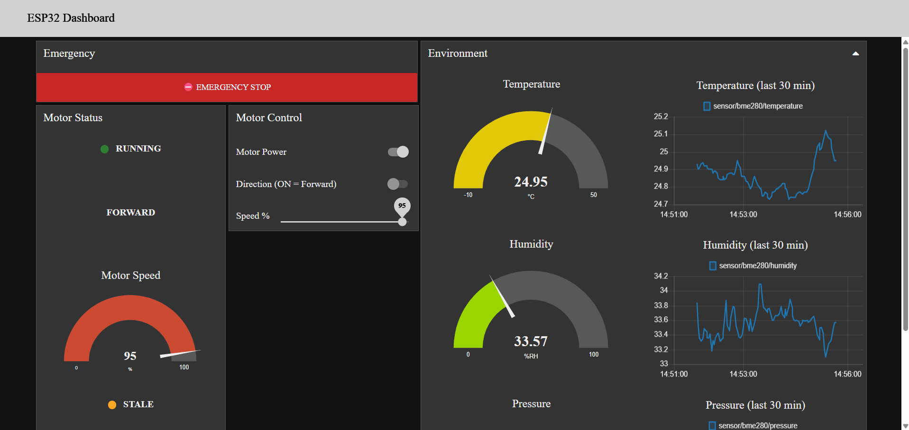
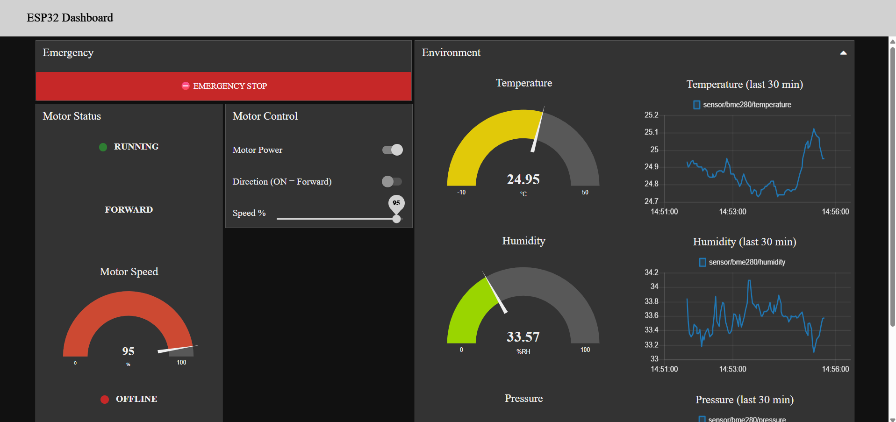

# Task 3.1: Node-RED Dashboard — Visual Control & Live Telemetry

Builds on the Task 11 MQTT system (ESP32 + BME280 + DC motor + Mosquitto)
by replacing MQTT Explorer with a live Node-RED dashboard for monitoring
sensors and controlling the motor.

## Dashboard layout and how it meets the requirements

The dashboard has four groups on one tab:

| Group | Contents |
|---|---|
| **Emergency** | Always-visible, top-of-page red "EMERGENCY STOP" button |
| **Environment** | Temperature/humidity/pressure — each a gauge *and* a line chart |
| **Motor Status** | State (running/stopped, color-coded), direction, live speed gauge + numeric readout, connection status |
| **Motor Control** | ON/OFF switch, forward/reverse switch, speed slider |

### Live telemetry
- `sensor/bme280/{temperature,humidity,pressure}` each feed a `ui_gauge`
  and a `ui_chart` in parallel.
- Motor state/direction/speed come from `motor/status/*` — **not** an
  echo of the last command — so the dashboard shows what the ESP32
  actually reports back after applying a command.

### Real device state vs. stale/offline detection
Two mechanisms work together (`fn_conn_monitor` function node):

1. **LWT (primary):** the ESP32 now registers a Last Will on
   `device/esp32/status` (retained, QoS 1). If it disconnects
   uncleanly (Wi-Fi drop, power loss, crash), Mosquitto immediately
   publishes retained `"offline"` on its behalf. On a clean connect,
   the ESP32 itself publishes retained `"online"`. Because it's
   retained, a dashboard opened *after* a disconnect still sees
   `"offline"` immediately instead of nothing.
2. **Watchdog (secondary):** every telemetry/status message updates a
   `lastSeen` timestamp in flow context. A 3-second `inject` node
   re-evaluates: if the LWT says `online` but nothing has arrived in
   >8s (Wi-Fi hiccup that doesn't trigger a full LWT event), the
   indicator shows `STALE` (orange) instead of quietly keeping the old
   green "ONLINE" state.

Combined states shown: **ONLINE** (green) / **STALE** (orange) /
**OFFLINE** (red).

### Historical graphs across a session
`ui_chart` nodes buffer their own data server-side (configured to keep
the last 30 minutes via `removeOlder`/`removeOlderUnit`), so a browser
refresh re-syncs from Node-RED's buffer rather than starting empty.
This buffer lives as long as the Node-RED process runs — it does not
survive a Node-RED restart, since Task 3.1 only asks for persistence
"across a short session," not across restarts.

### Speed clamping
The slider is set to **publish on release** (`outs: "end"`), not while
dragging — documented here per the task's requirement. Its output
always passes through a `Clamp speed 0-100` function node before
publishing, which:
- clamps any value `< 0` to `0` and any value `> 100` to `100`,
- coerces non-numeric input to `0`.

This was tested by wiring a temporary `inject` node with payloads
`150` and `-40` directly into the clamp function — both were correctly
clamped to `100` and `0` before hitting `motor/command/speed`. The
ESP32's own `MotorController::setSpeedPercent()` clamps a second time
on the device, so an invalid value can't get through even if Node-RED
were bypassed entirely.

### Emergency stop
A separate always-visible button in its own **Emergency** group at the
top of the page, distinct from the normal ON/OFF switch. It publishes
`"0"` directly to `motor/command/state`, bypassing the switch, slider,
and clamp logic entirely for the fastest possible stop.

> Note: this is a **software** e-stop — it still depends on Wi-Fi/MQTT
> delivery and the ESP32 being responsive. It is not a substitute for
> a physical kill switch/relay on safety-critical hardware; the
> firmware here doesn't expose one, so this is the fastest stop
> achievable within the existing MQTT command interface.

### Responsive layout
`node-red-dashboard`'s default grid is responsive; groups are sized at
full or half width so they stack sensibly on a phone browser as well
as a laptop. Verify after import by resizing the browser window or
opening `/ui` on a phone on the same network.

## Firmware changes made for this task

`esp32/` contains the Task 11 firmware with two changes:

1. **LWT registered on connect** (`MqttInterlockClient::connectBroker`)
   — `device/esp32/status`, retained, `"offline"` as the will payload,
   `"online"` published (retained) right after a successful connect.
2. **Retained telemetry/status publishes** — `sensor/bme280/*` and
   `motor/status/*` are now published with `retain=true`, so a newly
   opened dashboard (or a Node-RED restart) immediately shows the
   last-known real values instead of blank gauges until the next
   publish cycle. Outgoing **commands** (`motor/command/*`) from
   Node-RED remain non-retained on purpose — a retained command would
   replay itself and could unexpectedly start the motor on ESP32
   reboot.

No topic names changed, so this firmware is drop-in compatible with
the Task 11 wiring/behavior.

## Topics (reused from Task 11, plus one new one)

| Topic | Direction | Payload |
|---|---|---|
| `sensor/bme280/temperature` | ESP32 → broker | float string, retained |
| `sensor/bme280/humidity` | ESP32 → broker | float string, retained |
| `sensor/bme280/pressure` | ESP32 → broker | float string (hPa), retained |
| `motor/status/state` | ESP32 → broker | `"1"`/`"0"`, retained |
| `motor/status/direction` | ESP32 → broker | `"forward"`/`"reverse"`, retained |
| `motor/status/speed` | ESP32 → broker | `"0"`–`"100"`, retained |
| `motor/command/state` | Node-RED → ESP32 | `"1"`/`"0"` |
| `motor/command/direction` | Node-RED → ESP32 | `"forward"`/`"reverse"` |
| `motor/command/speed` | Node-RED → ESP32 | `"0"`–`"100"` (clamped) |
| `device/esp32/status` *(new)* | ESP32 → broker | `"online"`/`"offline"`, retained, LWT |

## Dashboard screenshots
 
 
 
 
 
 
 
 
 JSON File: [flows](dashboard/flows.json).

See the full [Node-RED Visual Dashboard for a
Local ESP32 MQTT System](Project_8_Documentation.pdf) for schematics, firmware, and calibration notes.

 ## Demo

[Watch the demo video](dashboard/Dashboard_Screen_Recording.mp4)
