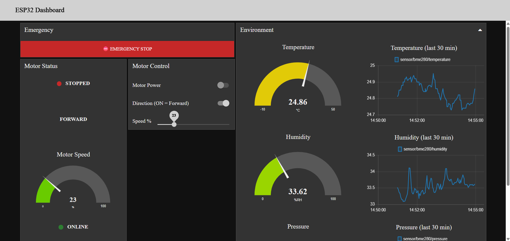
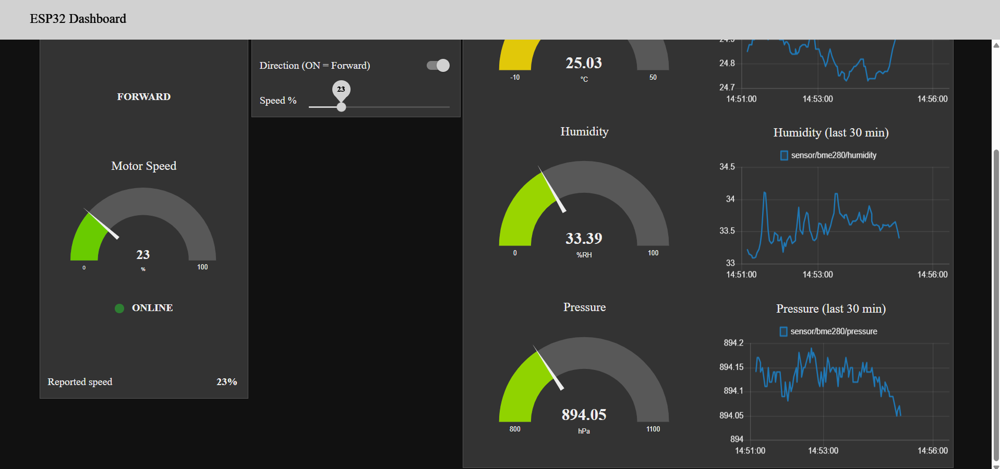

## Task 3.3 — Firebase Realtime Database Cloud Logging

Building on Task 3.1's Node-RED dashboard, this task adds a cloud-logging branch that mirrors live sensor and motor state to a Firebase Realtime Database, alongside a timestamped history log — without introducing a second MQTT subscription or duplicating any existing logic.

### Data structure

```
/current
   temperature: 23.13
   humidity: 39.38
   pressure: 895.72
   motor:
      state: "0"
      direction: "forward"
      speed: 0
   status: "online"
   lastUpdated: 1786526842309

/history
   -OzpI0c5j37hCJZvMwC5:
      temperature, humidity, pressure, motor, status, lastUpdated,
      timestamp: 1786526842309
   -OzpI0d...: { ...next snapshot, 15s later... }
```

- **`/current`** — a single object representing "right now." Overwritten in full via a Firebase `Set` operation every time any tracked value changes. Always reflects live state; there is nothing to compute when reading it.
- **`/history`** — an append-only log. Every 15 seconds, whatever is currently cached is snapshotted, stamped with a `timestamp`, and written via a Firebase `Push`, which generates a unique key per entry so nothing is ever overwritten.

### How it taps into the existing flow (no duplicate logic)

Firebase writes are a pure branch off nodes that already exist in the Task 3.1 flow — no new MQTT subscriptions, no second copy of the validation or connection-monitoring logic:

- **Sensor values** are tapped from the output of the existing `string to int` change nodes — the same validated, numeric values already driving the dashboard gauges and charts — not the raw MQTT payloads. This deliberately avoids repeating the payload-type bug from Task 3.1 (where an un-converted string payload silently broke the history charts).
- **Motor status** (`state`, `direction`, `speed`) is tapped straight from the existing `motor state in` / `motor direction in` / `motor speed in` MQTT nodes.
- **Online/offline status** is tapped from the existing `Connection monitor` function's output — the same dual-signal (LWT + watchdog) logic from Task 3.1 — rather than reading the raw `device/esp32/status` LWT topic a second time. This avoids two independent writers racing to set status, which would have reintroduced the exact "stale state" problem the watchdog exists to prevent.

All of the above feed into one function node, `Merge to Firebase current`, which keeps a running snapshot in `flow` context (shared across nodes on the tab) keyed by MQTT topic, stamps it with `lastUpdated`, and forwards the full object to a `Firebase out` node (`Set`, path `current`).

A separate `inject` node fires every 15 seconds into `Snapshot for history`, which reads that same shared `flow` context (not a second data path), adds a `timestamp`, and forwards it to a second `Firebase out` node (`Push`, path `history`).

### Verified behavior

- `/current` updates live and matches values shown on the dashboard gauges/indicators.
- `/history` accumulates one full snapshot every 15 seconds with a unique key per entry.
- Disconnecting the ESP32 (killing power/Wi-Fi) causes `/current/status` to reflect `"offline"` within seconds, using the existing LWT — verified by manual disconnect test.

### A bug worth noting

An early version of the history branch silently wrote nothing: `Merge to Firebase current` and `Snapshot for history` are two separate function nodes, and Node-RED's default `context.get()`/`context.set()` is scoped per-node, not shared. `Snapshot for history` was reading from its own empty context every tick and returning `null`. The fix was switching both functions to `flow.get()`/`flow.set()`, which is shared across every node on the tab. No error was thrown — the branch just never fired — which made this a "check the data is actually arriving" bug rather than one visible from a red error triangle.

### Credentials

The Firebase service account key (`firebase-key.json`) is stored outside the repository and referenced by the Node-RED Firebase config node. It is **not** committed to version control — see `.gitignore`.

## Firebase screenshots


## Dashboard 
 
 
 
 
 
 
 
 
 ## node-RED Flow:
  JSON File: [flows](dashboard/flows.json).

  

See the full [Node-RED Visual Dashboard for a
Local ESP32 MQTT System](Project_9_Documentation.pdf) for schematics, firmware, and calibration notes.

 ## Demo and Screen Recording

[Watch the Screen Recording video](dashboard/Dashboard_Screen_Recording.mp4)

[Watch the demo video](dashboard/Demo.mp4)
